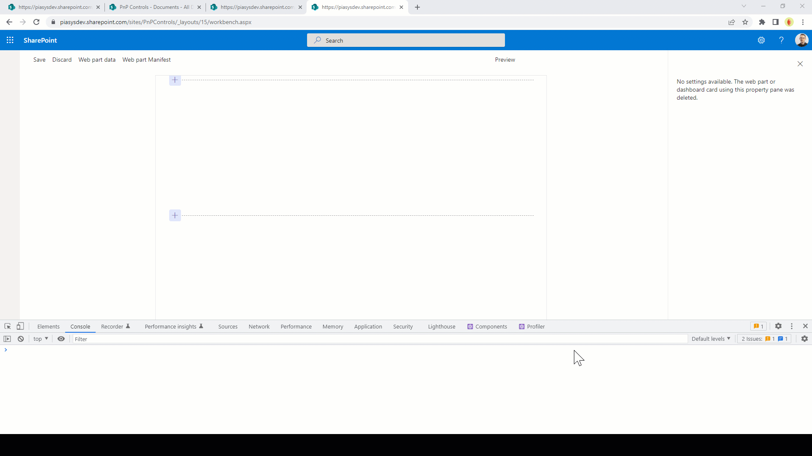

# Repro of the undefined pageContext issue
Follow this animated GIF to understand how the bug behaves.

It might be something that I do in the wrong way, I'm not saying that it is a PnPjs or an SPFx bug.
The only thing that puzzles me is that the bug is not deterministic. Sometimes it works, sometimes it doesn't.
Smells like something related to async code execution, which sometimes fails to provide a value to pageContext before we use it.

